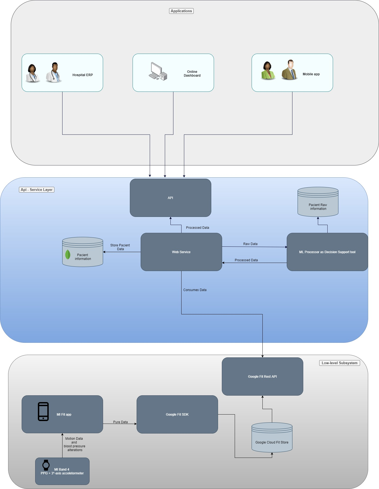

# Asclepio
Project Asclépio

# Objectives
Asclepio is a POC, of a API that requests a decision tool that will use machine learning to provide treated data to be used
by many differente applications.
This Poc uses only a basic decision logic and provide one endpoint just to put into code the intention behind the whole Asclepio architecture.


# Asclepio Original architecture
This POC is just an outline of how the api component would behave.


# How to run
## Requisits 
MongoDB instance's credentials, since its just for study purposes are foundable in the code for a local instace, although i strongly recommend
use Dokcer  image for MongoDB and run the following commands:
```shell
docker pull mongo
docker run --name asclepiomongo -p 17017:27017 -d mongo
```
The next step would be run the code, on all operational systems you can use the dotnet core CLI and simple run on the project folder
```shell
dotnet run 
```

and test it on the REST client of your choice.
